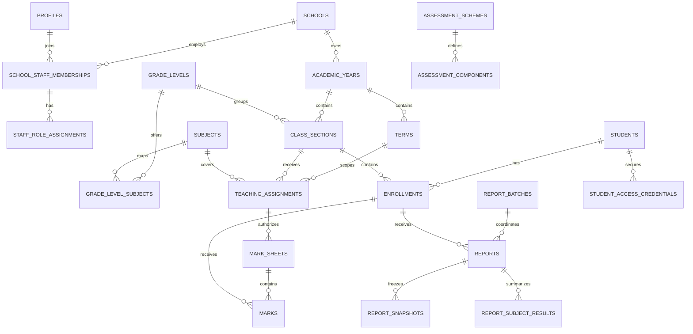

# Database Design

## Scope and source of truth

The Supabase migrations in `supabase/migrations` are the only schema source of
truth. They create a normalized foundation for academic configuration, marks
workflow, reports, parent-access credentials, and audit records. Application
screens, calculations, authentication flows, storage buckets, and final
authorization policies are intentionally deferred.

The local seed is configuration-only synthetic data. Grade levels, subjects,
assessment weights, grading thresholds, and school identity remain data-driven;
the seed is an example, not production policy.

## Entity groups and ownership

- **School and identity:** `schools` owns school-scoped data.
  `school_staff_memberships` links an Auth-backed `profile` to a school, and
  `staff_role_assignments` gives a membership zero or more roles.
- **Academic structure:** an `academic_year` owns terms and class sections.
  Grade levels and subjects belong to a school and are joined through
  `grade_level_subjects`.
- **Learners:** students and guardians belong to a school and form a many-to-many
  relationship through `student_guardians`. Enrollments place a student in one
  class section for an academic year while retaining prior years.
- **Teaching and assessment:** term-scoped teaching and class-teacher
  assignments identify staff scope. Versioned assessment schemes own weighted
  components.
- **Results:** a mark sheet is the workflow aggregate for one class, subject,
  term, scheme, and teaching assignment. Marks attach an enrollment and
  assessment component to that sheet.
- **Rules:** grading scales, ranking rules, and promotion rules are versioned and
  can be scoped to a school, year, or grade level.
- **Reports:** batches coordinate generation. Reports are versioned records;
  immutable snapshots preserve the source used for historical rendering.
- **Restricted access and audit:** parent credentials and sessions store hashes
  only. Audit events are append-only.

## Integrity and history

Users can have several roles because authorization responsibilities overlap and
change independently. Revoking a role timestamps the assignment instead of
rewriting history. Staff memberships, enrollments, teaching assignments, and
class-teacher assignments similarly use status or effective dates.

Workflow state lives on `mark_sheets`, not individual marks. This makes a
teacher's complete class-subject result set the unit of submission, review,
return, approval, and locking. Sheet versions preserve revisions, while each
mark's `row_version` provides a future optimistic-concurrency boundary.

Rules and report templates are versioned. Active-record partial unique indexes
prevent conflicting current versions while retaining retired records. Reports
use immutable JSON snapshots so later edits to live marks or configuration
cannot silently change an already generated historical report.

Key database checks include:

- one active academic year per school;
- terms within their year and class sections within the same school/year;
- one active enrollment per student and academic year;
- school-consistent guardian, subject, staff, and assignment relationships;
- active assessment components totaling exactly 100 percent;
- scores consistent with attendance, component maximums, and class enrollment;
- non-overlapping grading bands with adjacent boundaries allowed;
- valid report counters, versions, lifecycle timestamps, and academic scope;
- override reasons and promotion-term confirmation requirements; and
- one active parent credential per student, with hashes rather than plaintext.

## Workflow actor integrity

Membership-backed actor columns are checked against the school that owns the
target record. This applies independently of RLS and also protects writes made
through privileged server operations:

- role grantors must share the receiving membership's school;
- mark-sheet submitters must match the teaching assignment membership, while
  reviewers, approvers, lockers, and returners must share the sheet's school;
- mark creators/updaters, attendance recorders, and student-comment
  creators/updaters must share the applicable academic school;
- report creators, reviewers, publishers, and withdrawers must share the
  report's school; and
- the existing assessment/rule/template creators, report-batch requesters,
  promotion confirmers, credential creators, and teaching/class assignments
  retain their same-school checks.

Audit memberships must share the event school and match the supplied profile.
A profile-only audit actor must have a membership in the event school. Both
audit actor columns being null explicitly identifies a system-generated event.

These checks establish referential scope, not permission. Stage 5 will decide
which roles may grant roles, review or publish reports, approve or lock mark
sheets, and perform other workflow actions. A future administrative
mark-submission override would require an explicit, documented schema and audit
mechanism rather than substituting an unrelated submitter.

## Deletion decisions

Foreign keys use `ON DELETE RESTRICT` throughout the Stage 3 academic model.
Schools, people, academic periods, assignments, marks, reports, promotion
decisions, credentials, and audit records may carry historical or security
meaning and must not disappear through a cascading parent deletion. Lifecycle
status, revocation, expiry, withdrawal, supersession, or archival is preferred.

Even dependent configuration and junction rows are restricted in this stage.
This conservative choice prevents accidental loss before controlled
administrative workflows and audit behavior exist. A future migration may
introduce a narrowly justified cascade only with migration tests and documented
retention impact.

## Deferred structures

Ranking and promotion JSON configuration, report template configuration,
storage paths, report artifact checksums, and parent session metadata are
schema foundations for later stages. Stage 3 does not implement calculation
engines, final report layouts, storage policies, parent verification, or
automatic promotion.

## Stage 5 authorization structures

Migration 10 adds the stable `app_permission` enum and the
`role_permissions` system-configuration table. The role/permission pair is
unique, RLS is enabled and forced, browser access is revoked, and the initial
matrix is migration-controlled rather than school-editable.

Caller-scoped helpers derive authority from `auth.uid()`, active memberships,
active schools, unrevoked role assignments, and current teacher assignments.
The public permission RPC returns generated enum values only for the caller's
own requested membership. No Stage 3 domain table shape or historical
migration was rewritten, and no browser mutation policy was added.

## Stage 6 mutation model

Migration 12 adds configuration lifecycle indexes, term overlap and promotion
term constraints, unique active subject ordering, curriculum ordering, and
retirement timestamps for versioned scales and rules. It exposes narrow RPCs
for each configuration aggregate. Draft assessment components and grading bands
are replaced transactionally with their parent draft; activation performs
aggregate validation. Existing migrations 1–11 remain unchanged.

Migration 13 preserves migration 12 and completes its workflow invariants. It
locks class-section year/grade identity after any enrolment, teaching or class
teacher assignment, mark sheet, or report dependency; makes curriculum
grade-subject identity immutable; and splits mapping creation from flag updates.
It also adds explicit version-from-existing functions for assessment, grading,
ranking, and promotion configuration, structured rule validation, transactional
whole-set reorder functions, and distinct create, edit, version, and lifecycle
audit actions. Promotion required-subject rules are a structured JSON array,
while ranking and additional promotion options use documented versioned objects.

Stage 6 stores configuration and history only. It does not calculate marks,
grades, rankings, aggregates, promotion recommendations, or promotion decisions;
those remain Stage 7 and later concerns.

Migration 14 adds trigger-enforced historical immutability. `mark_sheets`
require a compatible assessment scheme within the existing term, academic year,
grade, subject, class, and teaching-assignment scope. A referenced assessment
scheme cannot be re-scoped, re-versioned, re-dated, renamed, reassigned to a new
creator, deleted, or have components changed. Active and retired grading
scales/bands, ranking rules, and promotion rules are similarly immutable; draft
records remain the only editable versions. Promotion-decision inserts validate
the selected active rule without invalidating historic decisions after later
retirement.

Migration 15 separates assessment selection from historical workflow
continuity. `ACTIVE` is required on mark-sheet insertion and whenever
`assessment_scheme_id` changes. A `RETIRED` scheme cannot be newly selected, but
an existing sheet may retain that unchanged reference and receive later trusted
workflow updates. Complete scope validation still runs on every update, and the
retired scheme and its components remain immutable so existing marks preserve
their exact interpretation.

## Stage 7 learner-management model

Migration 16 retains the Stage 3 student, guardian, relationship and enrolment
tables. It adds normalized school admission uniqueness, current class-number
uniqueness, search/supporting indexes and normalization triggers. Student,
guardian and enrolment rows reject physical deletion. History is represented by
status, exit dates, preserved placements and append-only audit events.

Mutation functions separate profile edits, student status, enrolment creation,
safe enrolment edits, class movement, enrolment status, guardian identity,
relationships and photo metadata. `updated_at` is the optimistic-concurrency
token. A private Storage bucket keeps image objects outside PostgreSQL, while
`students.photo_storage_path` stores only the scoped object key. Parent
credential and session structures remain unchanged.

Migration 17 adds `enrollment_one_current_per_student_idx`, a preflight that
refuses inconsistent existing data, and lifecycle triggers that align current
enrolments with active students and validate exit dates. The capacity helper is
`VOLATILE`: it locks the destination `class_sections` row with `FOR UPDATE`,
recounts current placements and holds the lock within the caller transaction.
Student lifecycle and enrolment lifecycle remain separate aggregates. The
directory function returns `placement_is_current` and `class_is_active` so a
latest historical match is never presented as the current placement.

# Effective-dated teacher assignments

Stage 8 preserves `teaching_assignments` and `class_teacher_assignments`. GiST exclusion constraints prevent subject-scope period overlap and primary class-teacher period overlap. Historical identity is immutable, deletes are blocked, date narrowing checks downstream academic dependencies, and class-row locking serializes primary replacement.

# Stage 9 mark-sheet and mark-row design

`mark_sheets` holds immutable academic and scheme identity for one workflow
revision. Stage 9 creates only version 1 in `DRAFT` and never changes identity,
revision or workflow through its APIs. `marks` stores one optional entered cell per sheet, component and
enrolment; missing combinations remain implicit. Mutable cell fields are score,
attendance, teacher remark and update metadata. `row_version` is the cell
concurrency token and increments once per successful update.

## Stage 10 correction lineage

`mark_sheets.supersedes_mark_sheet_id` forms a one-successor immutable chain.
A correction is a new row with source version plus one, identical academic
identity/scheme/assignment, and cloned marks. A historical locked sheet is
never changed in place. The latest term/class/subject revision is authoritative
for readiness.
